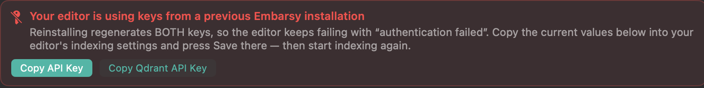
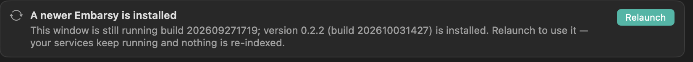
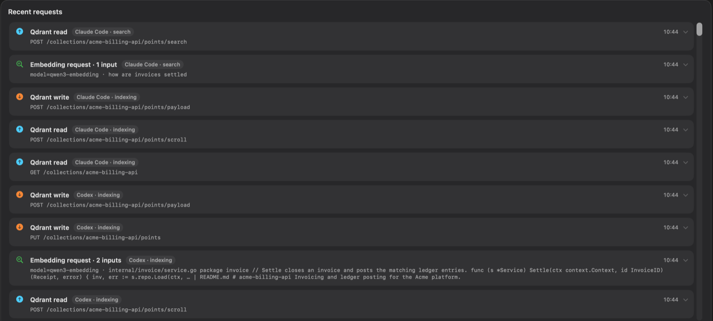

# Changelog

All notable changes to Embarsy are documented here. This project follows [Semantic Versioning](https://semver.org).

## 0.2.3 — beta (2026-10-05)

### Added

- **Connections: Claude Code and Codex in one click, nothing to install.** The How To tab became **Connections**, right after Status, with a tab per agent. **Connect** writes `~/.claude.json` or `~/.codex/config.toml` for you, and leaves every other server and setting in them untouched. Both editors can be connected at once. Node and the MCP bridge now ship inside Embarsy, so there is no npm, no Node and no setup command any more. The Zoo / Roo Code connection values moved here from Status.

  

- **Index folders from the app.** Under **Indexed folders**: **Add folder…** indexes a project, **Re-index** refreshes one (only changed files are re-embedded), and each row shows its size and when it was last indexed.

- **One connection serves every project.** The bridge picks the index from the folder the editor is working in, so nothing names a collection any more. Index a parent folder and every project inside it is covered; an agent working in one of them searches that project first and widens to the rest only when it finds nothing convincing there. Results come back as paths that open from where the agent stands.

- **Agents reach for the index instead of grep.** The bridge tells the agent, before its first step, what search by meaning is for and when grep is still the better tool. When the best match is weak, the result says so, and suggests grep, instead of presenting it as an answer.

### Fixed

- **The benchmark compares each collection with its own folder.** It used to race every collection against the single project folder from Settings, so any other collection stopped with "This collection does not match the folder". The folder now follows the selected collection and opens in Finder.
- **Every `.gitignore` in a folder counts, not just the top one.** A folder holding several projects was indexed with only its own rules, so each project's build output went in too. Xcode / SwiftPM build folders are skipped as well.
- **The Connections folder list no longer reads "No folders indexed yet" right after launch,** before it has heard back from the API.
- **Monitoring no longer shows 0 for numbers it doesn't know yet.** "Points indexed" asked for its total once, when the tab opened; if the API was still starting, it read 0 for the rest of the session. It now retries until it gets an answer and follows indexing while the tab is open. Every tile, and CPU before its first real reading, shows "—" until its value is known.

### Changed

- Bridge `embarsy-qdrant-mcp` 0.1.8 is bundled with the app; installing it from npm is no longer needed.

## 0.2.2 — beta (2026-09-28)

### Fixed

- **Content says which project each collection holds — and opens it in Finder.** Rows began with a bare "Looks like a Go project: 220 files…", missing the one thing you scan the column for. The name now leads the row as a link. Retroactive: collections you already indexed get it without re-indexing. Rows with no real folder behind them stay plain text rather than link somewhere wrong.

  

- **"Authentication failed" now says what actually broke.** A reinstall regenerates both keys, so an editor configured earlier fails forever with a bare "authentication failed". The API now names the cause — a key from a previous install, or the two keys swapped — and Status raises this while it is happening, with one-click Copy for each key.

  

- **Installing over a running Embarsy no longer does nothing, quietly.** macOS leaves the old app running when its bundle is replaced, so a new version appeared to change nothing — and the API Update button could not help, since it compares against the version inside the code still running. Status now reads the installed bundle from disk and offers Relaunch; services keep running.

  

- **Activity says which client made each request.** With Claude Code, Codex and Zoo / Roo Code installed side by side it was impossible to tell which of them was actually using the index — every row looked the same. Each row now carries the client and whether it was indexing or searching. Two honest limits: Claude Code and Codex spawn the identical bridge binary, so the editor is known only because its setup command wrote it down — re-run `embarsy-mcp --setup-claude` / `--setup-codex` once to get the name; and clients that talk to the proxy directly cannot be named at all, so they read "Unknown client".

  

- **Service status is no longer stale.** Health is re-checked every ~10s for the app's lifetime, so a service that dies later stops reading "Running · Health check OK"; one that crashed says so, with the path to its log. Two consecutive failures are required, so a single timeout can't make a healthy service flicker.

- **The uptime on Status counts again.** It was computed on demand, so it only ever changed when something else on the screen did — and the quieter the status poll became, the longer it sat at "0m".

- **The support row no longer shows a personal Telegram contact.** Bug reports go through the form; releases through GitHub.

### Changed

- Bridge [`embarsy-qdrant-mcp`](https://www.npmjs.com/package/embarsy-qdrant-mcp) 0.1.7 identifies itself to Embarsy (which editor, and whether it is indexing or searching) and records the indexed folder's name and path, so collections indexed through Claude Code / Codex get the name and the Finder link too — re-run `embarsy-index` once per project, no re-embedding.

## 0.2.1 — beta (2026-07-09)

### Added
- **Benchmark on the Status screen: grep vs meaning, on your own code.** One click runs a duel — questions are sampled from your real indexed chunks (concept words a human would type), and the same query goes to both engines: the semantic index and an actual `grep -riE` over your project folder. You see the three numbers that matter: how often the right file lands in the top-5, the median time to a ranked answer, and how much output there is to sift (thousands of grep lines vs a handful of ranked snippets). A "live duel" section runs the same questions end-to-end through your own coding agent (Claude Code / Codex CLIs, with grep-only vs `search_code` toolsets) and reports wall-clock time, tokens and correctness; Zoo / Roo Code gets paste-ready duel prompts.

### Fixed
- **Emoji cut in half no longer breaks indexing (HTTP 500).** Clients that slice text by UTF-16 units (editor chunkers) can send half of an emoji — a lone `\ud83d` surrogate. JSON transports it happily, but re-encoding to UTF-8 for Ollama raised `UnicodeEncodeError` and failed the whole embeddings request; the same broken character could 500 the Content overview and silently kill the metrics persister. The API now sanitizes all incoming and Qdrant-sourced text (lone surrogates become `�`, real emoji untouched), and the bridge `embarsy-qdrant-mcp` 0.1.3 stops producing them in the first place — chunk boundaries never split a surrogate pair, plus the same sanitization as defense in depth.

## 0.2.0 — beta (2026-07-07)

Download `Embarsy-0.2.0-arm64.dmg` from the release assets (see 0.1.0 below for full setup, requirements, and first-launch instructions).

### Added
- **One-click API update on the Status screen.** After installing a new Embarsy version, the previous API process can still be serving on port 8000 — new features (like vector quantization) silently wouldn't apply. The app now compares the running API's version (`/health` reports it) with the one bundled in the app, and shows an **Update** button next to the API row that restarts only the API — Qdrant, Ollama, the model and all indexed data stay untouched. On its first start the updated API migrates existing collections to the quantized layout automatically.

### Fixed
- **Install no longer fails while the API is still warming up.** The final install step used to give the Embarsy API a hard 15-second health budget — but the API's very first start after a fresh install can spend ~20s just unpacking and validating itself, so installs failed moments before the API came up (and only a reboot seemed to help). The health wait now keeps waiting while the process is alive (up to 2 minutes for the API), fails fast with the real exit reason if the process dies, retries the API step once, and no longer claims "Components are not installed" when only the API step failed — Qdrant, Ollama and the model stay put.
- **Failure evidence survives.** If a service fails to start, its log tail and exit status are copied into the debug log automatically; the debug log is rotated (not overwritten) on every launch; and Remove Components archives the logs to `~/Library/Logs/Embarsy/` before deleting anything.
- **Stop All now actually stops the stack.** After relaunching the app, the running services belong to the previous app instance — Stop All used to stop only processes the current instance had spawned, so the UI said "Stopped" while Qdrant, Ollama and the API kept running. Stop All now also terminates whatever is listening on the managed ports, exactly like Start All's clean-start path always did.
- **Service status self-corrects after start.** A service that was slow to pass its health check (usually the API loading its model) no longer stays stuck on "Failed" — the Status page and the menu-bar dropdown now re-check for a while after any start and flip to "Running" automatically, so you don't have to press Refresh.

### Performance
- **Monitoring is dramatically smoother.** Scrolling no longer hitches at large time ranges: refresh ticks only re-render the Monitoring tab (not the whole window), each chart skips re-layout when its data hasn't changed, client-side series are decimated peak-preservingly (up to 1800 points → ≤300), and chart JSON is decoded off the main thread. Same pixels, same refresh behavior.
- **Big battery savings on laptops.** The API no longer rewrites its multi-megabyte metrics state file up to once per second (now a background flush every 30s); service logs are rotated instead of growing unbounded (ollama.log could reach hundreds of MB per day); per-request access logging is off (the Activity screen still shows everything); HTTP connections to Qdrant/Ollama are pooled; Activity polls now fetch only new events; polling and decorative animations pause while the window can't be seen; system-metrics sampling slows to 15s when Monitoring isn't visible; and the embedding model unloads after 30 idle minutes instead of staying pinned in RAM.

### Changed
- **"What seems indexed" is human-readable now.** The Content column no longer opens with the raw collection id ("ws-… collection workspace: …") — it reads like a sentence: *"Looks like a PHP project: 224 files, mostly PHP and Markdown. Key areas: app, AppBundle and Maxposter."* Languages are ordered by how often they actually occur (not alphabetically), the project kind is inferred from the dominant code language, and the expanded preview no longer repeats the name twice.
- **New app icon.** The icon now follows the macOS icon grid (824px squircle on the 1024px canvas with standard margins) instead of filling the whole canvas, so it sits at the same visual size as other apps in Finder and the Dock — and the washed-out white background is replaced with the brand dark gradient and teal mark. Small sizes (16/32px) are rendered from vectors with a slightly heavier stroke so the mark stays legible in list views.
- **Optimal vector quantization by default.** Every collection created through the Embarsy proxy now gets int8 scalar quantization (quantile 0.99, always in RAM) with full-precision originals on disk — searches run on a 4x-smaller SIMD-accelerated copy and the top candidates are rescored against the originals, so quality is unchanged while RAM and disk I/O drop substantially. Existing unquantized collections are migrated automatically in the background (no re-indexing needed); the `embarsy-qdrant-mcp` bridge (0.1.2) creates its collections with the same layout.
- **How To** now includes an "Updating the bridge" section (Claude Code / Codex) — how to update the `embarsy-qdrant-mcp` bridge and re-index.
- Bridge `embarsy-qdrant-mcp` 0.1.1 (published separately on npm) fixes a crash when indexing minified / one-line files: character-bounded chunking, an embedding-input cap, resilient retries, and skipping minified blobs.

## 0.1.1 — beta (2026-07-06)

Download `Embarsy-0.1.1-arm64.dmg` from the release assets (see 0.1.0 below for full setup, requirements, and first-launch instructions).

### Fixed

- **Editor bridge** — the setup previously relied on `@kindash/qdrant-mcp-server`, which was removed from npm. Replaced with own published [`embarsy-qdrant-mcp`](https://www.npmjs.com/package/embarsy-qdrant-mcp), so the Claude Code / Codex steps in **How To** install cleanly again — with one-command `embarsy-mcp --setup-codex` / `--setup-claude`.
- **Start All** is now disabled while any service is running (avoids "Start All finished with status: Failed" when the stack is already up).

## 0.1.0 — beta (2026-07-06)

First public beta of **Embarsy** — a native macOS menu-bar app that runs a **local semantic code-index stack** (Qdrant + Ollama + a small FastAPI proxy), so your editor and AI clients can search code by meaning, fully offline.

### Highlights

- **One-click install** — sets up and manages the whole stack (Qdrant vector DB, Ollama embeddings, Embarsy API). No terminal needed.
- **Start / stop in one place** — bring the stack up or down from a button or the menu-bar icon.
- **Content view** — browse indexed Qdrant collections with file / language / area previews; slide to delete a collection.
- **Live monitoring** — reads/writes, embedding latency, and system resources (memory, CPU, temperature) with time-range and refresh controls.
- **Request activity** — inspect embedding / read / write events to see exactly what's being indexed.
- **Editor bridge** — [`embarsy-qdrant-mcp`](https://www.npmjs.com/package/embarsy-qdrant-mcp) indexes your codebase into Qdrant and serves an MCP `search_code` tool, with one-command setup for Claude Code and Codex (Zoo / Roo Code has built-in indexing). Everything routes through Embarsy's proxy, so both the embedding and Qdrant counters move.
- **Built-in setup guides** — How-To for Claude Code, Codex, and Zoo / Roo Code.

### Requirements

- macOS 13 (Ventura) or later
- Apple Silicon (arm64)

### Install

1. Download `Embarsy-0.1.0-arm64.dmg` from the release assets.
2. Open it and drag **Embarsy** into Applications.
3. **First launch** (self-signed beta): if macOS blocks it, open **System Settings → Privacy & Security**, scroll to the bottom and click **Open Anyway**, then launch again. If it says the app is "damaged", clear the download quarantine once and launch:

   ```bash
   xattr -dr com.apple.quarantine /Applications/Embarsy.app
   ```

4. In Embarsy, open **Install → Install and Start**, then copy the connection values from **Status** into your editor's codebase-indexing settings.

### Known limitations

- Not signed with a Developer ID / not notarized yet — Gatekeeper needs a one-time approval (see Install step 3).
- Apple Silicon only — no Intel build.
- Memory / CPU / temperature history is kept in memory (~1h) and resets on relaunch.
