<p align="center">
  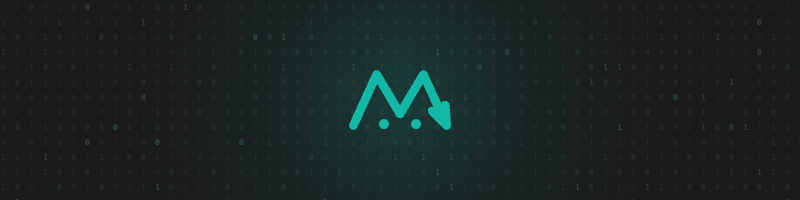
</p>

<h1 align="center">Embarsy</h1>

<p align="center">
  <b>Give your AI agent an understanding of your code. One click. 100% local.</b>
</p>

<p align="center">
  Your coding agent is brilliant — and blind. It greps your codebase for words and drowns in
  thousands of matching lines. <b>Embarsy gives it meaning instead</b>: a private, local
  <b>semantic index</b> of your code that answers <i>"where is the logic that…"</i> in ~100&nbsp;ms
  with five ranked snippets — not a wall of grep output. Built for <b>Roo&nbsp;Code, Zoo&nbsp;Code,
  Claude&nbsp;&amp; Codex</b>. Nothing ever leaves your Mac.
</p>

---

## grep reads words. Embarsy reads meaning.

Don't take our word for it — **Embarsy ships its own benchmark, and it runs on <i>your</i> code.**
One click on the Status screen pits real `/usr/bin/grep` (playing its best game — the classic AND
pipeline, scoped to the exact folder the index covers) against the semantic index, on questions
sampled from your own indexed files:

<p align="center">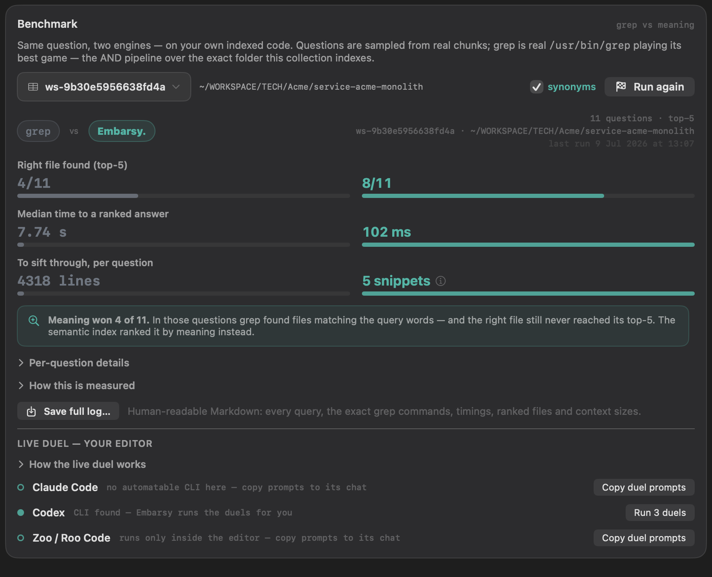</p>

On a real production monolith, in this run:

- **Right file found:** semantic **8/11** vs grep 4/11 — with the file ranked **#1** most of the time
- **Time to a ranked answer:** **102 ms** vs 7.74 s — ~75× faster, per question
- **What your agent must read:** **5 ranked snippets** vs 4,318 matching lines of grep noise

That last line is the real product: every grep line your agent "sifts" is context-window budget and
tokens you pay for. Five already-relevant snippets *are* the understanding.

**And it's honest.** The benchmark refuses to run if the index doesn't match the folder. grep is
never made to scan folders the index doesn't cover. Every grep command is shown verbatim and
copy-pasteable. A **synonyms mode** swaps one word per question for a synonym — the paraphrase test
literal search can't ace by construction. And **Save full log…** exports a human-readable Markdown
report — every query, exact commands, timings, ranked files, context sizes — so you can re-check
every number by hand. There's even a **live duel** mode that runs the same questions end-to-end
through your own coding agent, with and without Embarsy, and compares wall-clock time and tokens.

---

## Simple. Clear. Transparent.

**Simple** — one button installs and wires the entire stack: Qdrant, Ollama, the
`qwen3-embedding` model. No terminal, no Docker, no Python, no API keys to mint. Claude Code and
Codex connect with one more click; Zoo / Roo Code get copy-paste connection values.

**Clear** — you always see what's indexed (per-project clusters with languages and areas), what
it costs your machine (live CPU, memory, temperature), and what's happening right now (every
embedding and vector operation, streamed).

**Transparent** — the numbers are measured on your code, the methodology is disclosed in the app,
the logs are exportable, and everything runs on `127.0.0.1`. No cloud. No telemetry. No trust
required.

---

## Highlights

### ① One-click install of the entire embedder stack

No terminal, no Docker, no Python setup. Embarsy downloads and wires up the whole local stack —
**Qdrant**, **Ollama** and the **`qwen3-embedding`** model — from a single button, then verifies every
service is healthy before it reports ready.

<p align="center">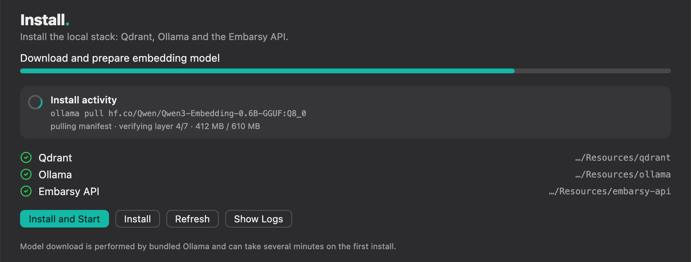</p>

### ② Connect Claude Code and Codex — one click, nothing to install

**Connections** has a tab per agent. **Connect** writes the editor's own config for you — both can be
connected at once — and the MCP bridge and Node ship inside Embarsy, so there is no npm and no setup
command. Add the folders your agents should know with **Add folder…**: one connection then serves
every project, picking the index from the folder the agent is working in.

<p align="center">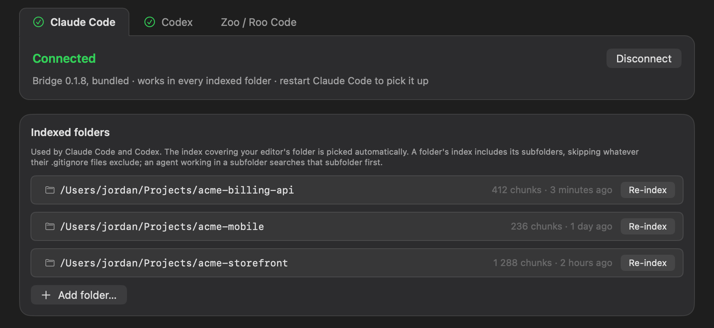</p>

### ③ See what your agent understands — per project, one-swipe cleanup

Every workspace becomes a Qdrant collection. The **Content** tab leads each row with **the project's
name — and clicking it reveals that folder in Finder**, so you never have to decode a collection id
again. Under it: a safe, high-level summary — languages, areas, file globs and point totals. Slide
**`‹‹‹ delete`** on any collection you no longer need and reclaim its vector storage.

<p align="center">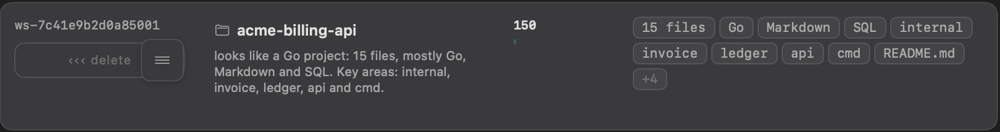</p>

### ④ Know which of your agents actually uses the index

Running Claude Code, Codex and Roo Code side by side? **Activity** labels every request with the
client that made it and whether it was **indexing** or **searching** — so "is this editor even wired
up?" stops being a guess. Embedding rows show the exact text being embedded; Qdrant rows show every
read and write.

<p align="center">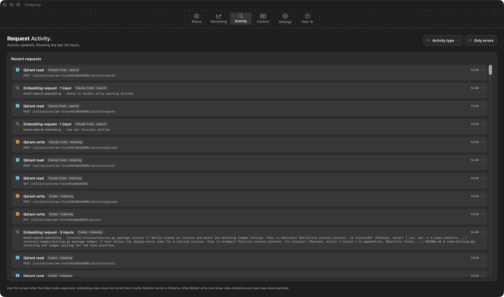</p>

### ⑤ Monitoring + resource usage at a glance

Grafana-style dashboards for embedding throughput, latency, and Qdrant reads/writes/errors — **plus
live Memory, CPU and temperature** of the running stack. Know exactly what indexing is costing your
machine, over the last hour, day or week.

<p align="center">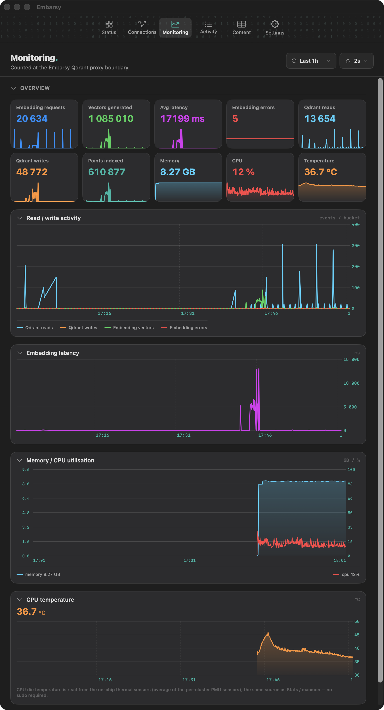</p>

### ⑥ Start &amp; stop the whole stack — one button, or the menu bar

Run everything with **Start All**, or control the stack without leaving your workflow straight from the
macOS **menu bar** — Start, Stop, Refresh and open your project, all a click away. One button removes
every component again — database, model, secrets — leaving your Mac exactly as it was.

<p align="center">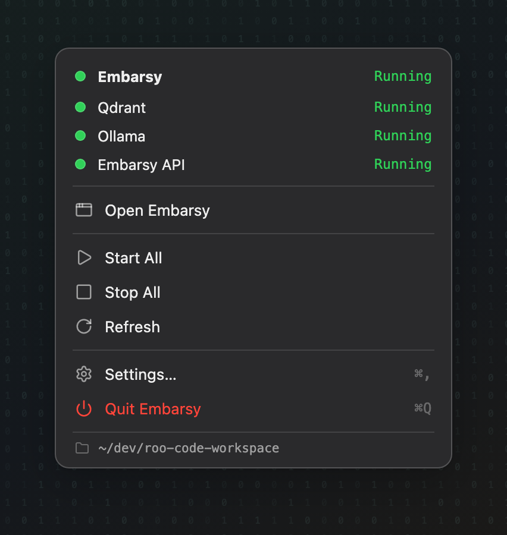</p>

---

## How it works

| Component | Role | Endpoint |
| --- | --- | --- |
| **Qdrant** | Vector database — stores your embeddings locally | `127.0.0.1:6333` |
| **Ollama** | Runs the `qwen3-embedding` model | `127.0.0.1:11434` |
| **Embarsy API** (FastAPI) | OpenAI-compatible `/v1/embeddings` + a Qdrant proxy | `127.0.0.1:8000` |

**Embarsy manages the infrastructure** and hands you the exact connection values to paste in — the
embeddings endpoint is OpenAI-compatible, so anything that speaks it just works. Everything runs on
`127.0.0.1`; **no cloud, no telemetry, no data leaves your Mac.**

Two ways in, depending on your agent:

- **Roo Code / Zoo Code** have indexing built in — they do the chunking, file watching and delta
  indexing themselves. Paste the connection values and you're done.
- **Claude Code / Codex** connect with one click in **Connections** — nothing to install. Embarsy ships
  its own MCP bridge, registers it with the editor, and indexes the folders you add; a `search_code`
  tool then answers the agent's questions from the index. The bridge tells the agent when to search by
  meaning and when grep is still the better tool, and says so plainly when a match is weak.

---

## Quick start

1. Download the latest **`Embarsy-*.dmg`** from [Releases](../../releases).
2. Drag **Embarsy** into Applications.
3. **First open.** Embarsy is a self-signed beta, so macOS Gatekeeper stops it once:
   - Double-click **Embarsy**; if the dialog offers **Open**, click it.
   - If it's blocked, go to **System Settings → Privacy & Security**, scroll to the bottom and click
     **Open Anyway**, then launch again.
   - Still blocked (or it says the app is "damaged")? Clear the download quarantine once, then launch:
     ```bash
     xattr -dr com.apple.quarantine /Applications/Embarsy.app
     ```
4. Open **Install → Install and Start**. Embarsy fetches Qdrant, Ollama and the embedding model, then
   starts the stack (the first model download takes a few minutes).
5. Connect your agent in **Connections**:
   - **Claude Code / Codex** — click **Connect** on the agent's tab, add your project with
     **Add folder…**, then restart the editor.
<p align="center">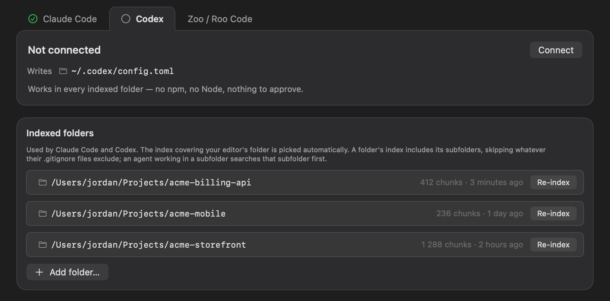</p>

   - **Roo Code / Zoo Code** — open the **Zoo / Roo Code** tab and copy the connection values into
     the editor's codebase-indexing settings. Point the **Qdrant URL** at the Embarsy proxy so
     Monitoring can count reads/writes.
<p align="center">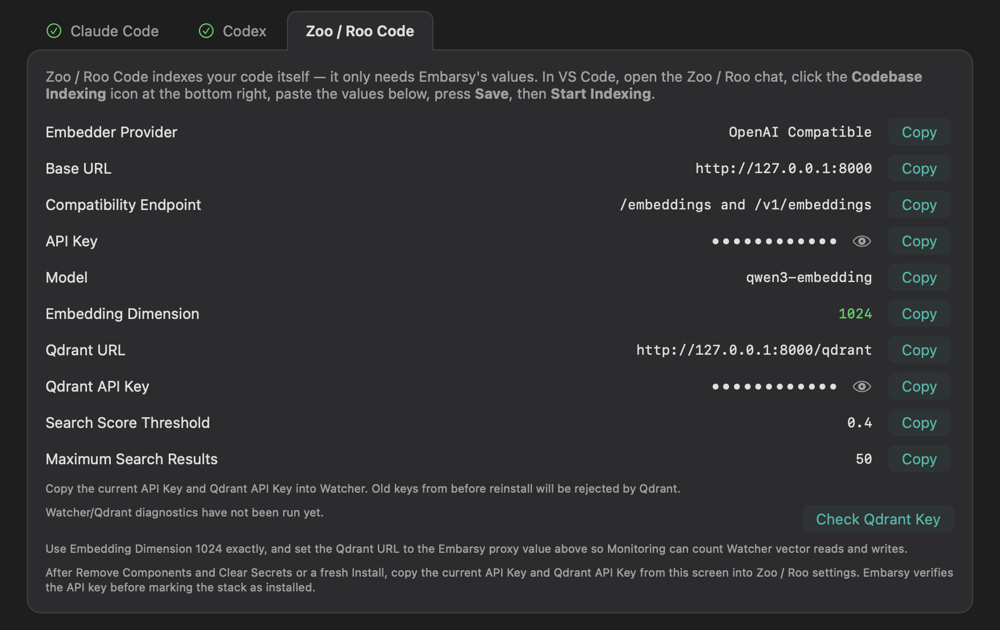</p>

6. Scroll down on **Status** and hit **Run benchmark** — watch grep and meaning race on your own code.

<p align="center">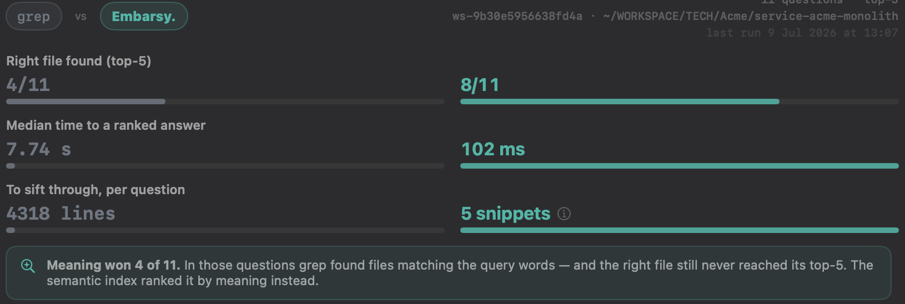</p>

---

## License

Embarsy is **source-available** under the **[PolyForm Strict License 1.0.0](LICENSE)** — **not** an
open-source license. It permits **noncommercial** use only; **selling, redistributing, or modifying**
the software requires a separate written license from the author.

Need a commercial or modification license? → **arsenyganov@gmail.com**

Bundled third-party components (Qdrant, Ollama, FastAPI, …) keep their own licenses — see
[THIRD_PARTY_NOTICES](THIRD_PARTY_NOTICES.md).

---

## Download

<p align="center">
  <a href="https://github.com/arsenyganov-pixel/embarsy-embedder/releases">
    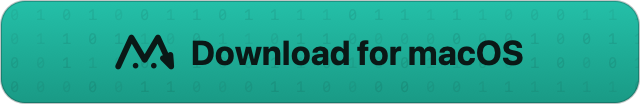
  </a>
  <br>
  <sub><code> · macOS 13+ · Apple Silicon · free beta · </code></sub>
</p>
