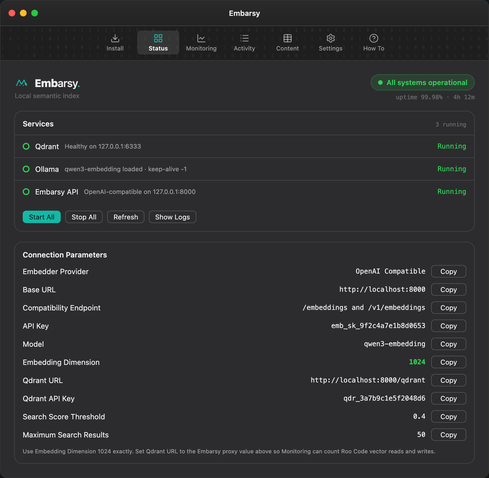

  

<h1 align="center">Embarsy</h1>

  <b>A local, private semantic‑index stack for AI coding assistants — one click, no terminal.</b>

  Embarsy is a native macOS menu‑bar app that runs a local <b>vector database (Qdrant)</b> and
  <b>embeddings (Ollama)</b> to index your codebase into a private <b>semantic index</b>. It gives
  AI coding assistants like <b>Roo Code, Zoo Code, Claude &amp; Codex</b> real <b>RAG</b> context and
  <b>semantic code search</b> instead of whole files — local‑first prompt optimization and context
  engineering. Nothing leaves your Mac.

---

## Why Embarsy

Codebase indexing for AI assistants usually means standing up Qdrant, wiring an embedding model,
juggling API keys and Docker. **Embarsy turns that whole stack into a one‑click desktop app** — and
then gives you a clear window into what got indexed and what it's costing your machine.

---

## Highlights

### ① One‑click install of the entire embedder stack

No terminal, no Docker, no Python setup. Embarsy downloads and wires up the whole local stack —
**Qdrant**, **Ollama** and the **`qwen3-embedding`** model — from a single button, then verifies every
service is healthy before it reports ready.

### ② See what's indexed — clusters per project, one‑swipe cleanup

Every workspace becomes a Qdrant collection. The **Content** tab shows a safe, high‑level summary of
each cluster — languages, areas, file globs and point totals — so you can tell at a glance what's
indexed for which project. Slide **`‹‹‹ delete`** on any collection you no longer need and reclaim its
vector storage.

### ③ Monitoring + resource usage at a glance

Grafana‑style dashboards for embedding throughput, latency, and Qdrant reads/writes/errors — **plus
live Memory, CPU and temperature** of the running stack. Know exactly what indexing is costing your
machine, over the last hour, day or week.

### ④ Start &amp; stop the whole stack — one button, or the menu bar

Run everything with **Start All**, or control the stack without leaving your workflow straight from the
macOS **menu bar** — Start, Stop, Refresh and open your project, all a click away.

---

## How it works

| Component | Role | Endpoint |
| --- | --- | --- |
| **Qdrant** | Vector database — stores your embeddings locally | `127.0.0.1:6333` |
| **Ollama** | Runs the `qwen3-embedding` model | `127.0.0.1:11434` |
| **Embarsy API** (FastAPI) | OpenAI‑compatible `/v1/embeddings` + a Qdrant proxy | `127.0.0.1:8000` |

Your editor (Roo Code, Zoo Code, …) does the Tree‑sitter chunking, file watching and delta indexing.
**Embarsy manages the infrastructure** and hands you the exact connection values to paste in — the
embeddings endpoint is OpenAI‑compatible, so anything that speaks it just works. Everything runs on
`127.0.0.1`; **no cloud, no telemetry, no data leaves your Mac.**

---

## Quick start

1. Download the latest **`Embarsy-*.dmg`** from [Releases](../../releases).
2. Drag **Embarsy** into Applications and launch it.
3. Open **Install → Install and Start**. Embarsy fetches Qdrant, Ollama and the embedding model, then
   starts the stack (the first model download takes a few minutes).
4. Open **Status**, copy the connection values, and paste them into your editor's codebase‑indexing
   settings. Point the **Qdrant URL** at the Embarsy proxy so Monitoring can count reads/writes.

---

## License

Embarsy is **source‑available** under the **[PolyForm Strict License 1.0.0](LICENSE)** — **not** an
open‑source license. It permits **noncommercial** use only; **selling, redistributing, or modifying**
the software requires a separate written license from the author.

Need a commercial or modification license? → **arsenyganov@gmail.com**

Bundled third‑party components (Qdrant, Ollama, FastAPI, …) keep their own licenses — see
[THIRD_PARTY_NOTICES](THIRD_PARTY_NOTICES.md).
